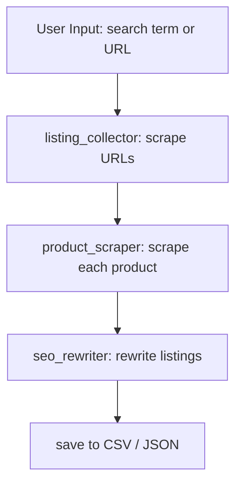

# CrewAI eBay Product Scraper + SEO Rewriter

This project uses [CrewAI](https://github.com/joaomdmoura/crewai) to build a multi-agent system that:

1. Scrapes eBay product listings based on a search term or store URL.
2. Extracts detailed product information (title, description, specs, price).
3. Rewrites listings to be SEO-optimized using a predefined template.

## 📁 Project Structure

```graphql
src/
└── ebay_seo_crew/
    ├── tools/
    │   ├── ebay_listing_collector.py     # Step 1
    │   ├── ebay_product_scraper.py       # Step 2
    │   └── utils.py                      # Output saving
    ├── config/
    │   ├── agents.yaml
    │   └── tasks.yaml
    ├── crew.py
    ├── main.py
    └── knowledge/
        └── seo_template.md               # 🔥 Ecom SEO rewriting guide
```

## 🎭 Agents
| Agent               | Role                      | Description                                                              |
| ------------------- | ------------------------- | ------------------------------------------------------------------------ |
| `listing_collector` | eBay Search Results Miner | Scrapes a list of product URLs from a keyword or store URL               |
| `product_scraper`   | Product Detail Scraper    | Visits each product URL and extracts: title, price, description, specs   |
| `seo_rewriter`      | Ecommerce SEO Expert      | Rewrites listings using a given template (pulled from `seo_template.md`) |

## 📋 Tasks
1. scrape_listings_task
    - **Input**: search term or URL
    - **Output**: list of product URLs
2. scrape_product_details_task
    - **Input**: list of URLs
    - **Output**: full product data (JSON: title, description, specs, price)
    - **Optional**: break this into multiple agents for scalability
3. rewrite_listing_task
    - **Input**: raw product info
    - **Output**: rewritten SEO-optimized listing per template

## 🚀 Execution Flow


## 🛠️ Requirements
```bash
pip install -r requirements.txt
```

## 📝 Configuration
Edit `src/ebay_seo_crew/config/agents.yaml` and `src/ebay_seo_crew/config/tasks.yaml` to configure agents and tasks.

## 🚀 Running the Crew
To run the multi-agent system, use the following command:

```bash
python src/ebay_seo_crew/main.py
```
## 📂 Output
The output will be saved in `src/ebay_seo_crew/tools/output/` as JSON files containing the scraped and rewritten listings.

## 🔥 SEO Rewriting Guide
For details on how the SEO rewriting is structured, refer to `src/ebay_seo_crew/knowledge/seo_template.md`. This file contains a comprehensive guide on best practices for eCommerce SEO.

## 📄 License
This project is licensed under the MIT License. See the [LICENSE](LICENSE) file for details.

## 📞 Contact
For any questions or contributions, please open an issue on the [GitHub repository](https://github.com/rp42dev/Crew-AI-ebay-product-scraper-rewriter.git) or contact the project me.
