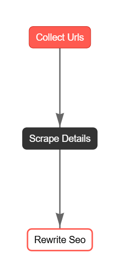

# 🚀 CrewAI eBay Product Scraper + SEO Rewriter + SKU + Markdown Generator

🎥 [V1 Demo on Facebook](https://www.facebook.com/61571514151327/videos/706298025685350/)  
🎥 [V2 Demo on Facebook](https://fb.watch/z-TH3QyFYe/)

This project is an intelligent multi-version toolchain designed to:
- 🔎 Scrape eBay listings based on search terms or seller store pages
- 📋 Extract full product details (title, specs, description, price)
- ✍️ Rewrite listings using SEO-optimized structure and keyword strategy
- 🆔 Automatically generate SKUs based on product data
- 📝 Convert listings into human-readable Markdown (for blogs, Shopify, Notion, etc.)

It leverages **CrewAI** agents, **Flows**, **Pydantic validation**, and modular processors to offer scalable, structured listing automation.

---

## 🔁 Version Comparison

| Version | Architecture              | Agents Used                         | LLM Usage     | Speed     | Output Type          | Best For                       |
|---------|---------------------------|--------------------------------------|---------------|-----------|------------------------|--------------------------------|
| **v1**  | Classic CrewAI             | 3 agents (Collector, Scraper, Rewriter) | 🔴 High       | 🟡 Medium | Markdown              | Full agent orchestration demo |
| **v2**  | Scripted single agent      | 1 agent                             | 🟢 Low         | 🟢 Fast   | Markdown              | Fast bulk rewriting            |
| **v3**  | CrewAI Flow + Pydantic     | 1 agent + `Flow` orchestrator       | 🟢 Optimized   | 🟢 Fast   | JSON → SKU + Markdown | Full structured automation     |

---

## 📝 Requirements

```bash	
pip install -r requirements.txt
```
---

## 🔁 Pipeline Overview (v3)

Version 3 is fully optimized for speed, clarity, and minimal LLM usage. Here's how it works:


---

### 🧩 Stage 1 – URL Collection

- Accepts either:
  - eBay **keyword search**
  - eBay **product listing URL**
- ⚠️ If you enter a **storefront URL** (e.g., `ebay.co.uk/str/yourstore`):
  - You must manually **click the “See All” button** on that page.
  - Copy the new results page URL (usually starts with `/sch/`) and paste it back.
  - This avoids CAPTCHA and ensures proper scraping.
- Uses polite scraping delays to reduce bot detection risk.
- Allows custom number of product URLs (default: **20**).
- Saves raw product metadata as:  
  📄 `store_items_<timestamp>.json`

---

### 🧪 Stage 2 – Product Detail Scraping
- Visits each product page
- Extracts key details:
  - `title`
  - `price`
  - `description`
  - `specs`
  - `url`
- Structured using `SEOProductInput` Pydantic model
- Saves: `detailed_listings_<timestamp>.json`

---

### ✍️ Stage 3 – AI SEO Rewriting
- Each product passed individually to a **single-agent Crew**
- Uses structured prompt + strict validation (`SEOProductOutput`)
- Fields include:
  - `rewritten_title` (max 80 chars)
  - `subtitle` (max 100 chars)
  - `rewritten_description` (550–650 characters, 3 paragraphs)
  - `key_specs` (exactly 5 bullet points)
  - `specs` (from original)
  - `seo_keywords` (2–3 terms)
  - `Meta Title` (max 60 chars)
  - `Meta Description` (max 160 chars)
  - `original_url`
- Saves: `rewritten_products_<timestamp>.json`

---

### 💾 Stage 4 – Output & Markdown Generation
- ✅ Individual `.md` file per product:
  - SEO title, subtitle
  - Price, description, key specs
  - Full specs, meta title/description/keywords
  - SKU and original URL
- ✅ Final JSONs:
  - `products_with_skus_<timestamp>.json`  
  - All files Markdown-ready and reusable

---

## 🧠 SKU Logic Summary
- Format: `CAT-SIZE-DEP-NAMECODE-RAND4`
  - **CAT**: Category (`BIK`, `HLM`, `SCT`)
  - **SIZE**: From wheel size/model (e.g., `24IN`, `700C`)
  - **DEP**: Department (`UK`, `MA`, `FA`, `UN`)
  - **NAMECODE**: Abbreviated from title
  - **RAND4**: Unique 4-char suffix

🧪 Example:  
`BIK-24IN-UK-24MOU-87A3`  
🛒 Title: `24-Inch Mountain Bike with Suspension and Disc Brakes`

---

## 📊 Token Usage Summary
- ✅ 17 listings rewritten: **~$0.0056 total** using `gpt-4.1-nano` or `gpt-4.0-mini`
- ✅ Markdown output, minimal cost, and strong structure

---

### ✅ To Run
```bash
python src/ebay_seo_crew_v3/main.py
```

## 📄 License
This project is licensed under the MIT License. See the [LICENSE](LICENSE) file for details.	

## 📧 Contact
For questions or contributions, please open an issue on GitHub.