# CrewAI eBay Product Scraper + SEO Rewriter

[Watch the video on Facebook](https://www.facebook.com/61571514151327/videos/706298025685350/)

This is an AI-powered, multi-agent system built with CrewAI that automates scraping eBay listings and rewriting them for SEO optimization — all with zero manual input.

🚀 Whether you provide an eBay store URL or just a search keyword, this system will:
 - Scrape product listings in bulk
 - Extract detailed product info (title, price, description, specs)
 - Rewrite each listing using SEO best practices via a custom template

## 🧠 Powered By
 - CrewAI
 - Custom tools (Selenium, BeautifulSoup)
 - Built-in knowledge injection (seo_template.md)
 - Modular YAML-based agent/task config

## 📁 Project Structure

```bash
src/
└── ebay_seo_crew/
    ├── tools/
    │   ├── ebay_listing_collector.py     # Scrape search/store 
    │   ├── product_scraper_tool.py       # Extract product 
    │   └── output/                       # Saved CSV/JSON output
    ├── config/
    │   ├── agents.yaml                   # Agent definitions
    │   └── tasks.yaml                    # Task definitions
    ├── crew.py                           # CrewAI configuration
    ├── main.py                           # Entry point
    └── knowledge/
        └── seo_template.md               # SEO rewriting template
```

## 🎭 Agents
| Agent ID                  | Role                   | What It Does                                                    |
| ------------------------- | ---------------------- | --------------------------------------------------------------- |
| `listing_collector_agent` | eBay Search Miner      | Scrapes a list of product URLs from search keyword or URL       |
| `product_scraper_agent`   | Product Data Extractor | Gathers title, price, description, and specs from product pages |
| `seo_rewriter_agent`      | SEO Copywriter         | Rewrites listings using the provided SEO template               |


## 📋 Tasks Overview
| Task                     | Input                     | Output                                 |
| ------------------------ | ------------------------- | -------------------------------------- |
| `scrape_listing_urls`    | eBay store URL or keyword | List of product URLs                   |
| `scrape_product_details` | Product URLs              | Full product data (title, specs, etc.) |
| `rewrite_seo_listings`   | Raw product info          | SEO-optimized rewritten listings       |


## 🚀 Execution Flow

```mermaid	
flowchart TD
    A[User Input: search term or store URL]
    --> B[🔍 listing_collector_agent: find URLs]
    --> C[📦 product_scraper_agent: extract details]
    --> D[✍️ seo_rewriter_agent: SEO rewrite]
    --> E[💾 Save to CSV / Markdown / JSON]
```


## 🛠️ Requirements
```bash
pip install -r requirements.txt
```

## 📝 Configuration
Edit `src/ebay_seo_crew/config/agents.yaml` and `src/ebay_seo_crew/config/tasks.yaml` to configure agents and tasks.

## 🚀 Running the Crew
To run the multi-agent system, use the following command:

```bash
python src/ebay_seo_crew/main.py
```
✅ You'll be prompted to enter:
 - A keyword (e.g., bike helmet)
 - Or an eBay store URL

The system will handle the rest, from scraping to rewriting.

## 📂 Output
```swift
src/ebay_seo_crew/tools/output/
```
 - Raw scraped listings: store_items_<timestamp>.csv
 - Rewritten SEO listings: seo_rewritten_listings.md

## 🔥 SEO Rewriting Guide
For details on how the SEO rewriting is structured, refer to `src/ebay_seo_crew/knowledge/seo_template.md`. This file contains a comprehensive guide on best practices for eCommerce SEO.

## 📄 License
This project is licensed under the MIT License. See the [LICENSE](LICENSE) file for details.

## 📞 Contact
For any questions or contributions, please open an issue on the [GitHub repository](https://github.com/rp42dev/Crew-AI-ebay-product-scraper-rewriter.git) or contact the project me.
